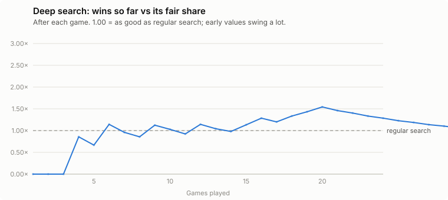

# Deep search vs regular search

_Updated 2026-09-28 04:50 UTC · 48 of 24 games played_

**Deep search:** the regular whole-turn planner (beam 3) picks its best 3 complete turns; each is played forward 2 more of my turns (everyone uses the regular planner, hidden cards dealt at random, the same deals for every candidate) and the best one is played. **Opponents:** the regular planner. Everyone uses the same current network. One deep seat per game; 3- and 4-player games alternate; seats rotate.

| | Deep search |
|---|---|
| Wins | **14 of 48** games |
| vs its fair share (1.00 = as good as regular search) | **1.00×** (± 0.44, 95%) |
| Arrival round (deep / regular) | 13.6 / 13.4 |
| Thinking time | 4.7 CPU-seconds per turn |

## Game by game

| # | Players | Deep's seat | Winner | Deep's place | Deep arrived | Deep's thinking |
|---|---|---|---|---|---|---|
| 1 | 3 | 1 | Regular (seat 2) | 3 of 3 | round 13 | 5.7 s/turn |
| 2 | 4 | 1 | Regular (seat 2) | 3 of 4 | round 17 | 4.1 s/turn |
| 3 | 3 | 2 | Regular (seat 3) | 2 of 3 | round 13 | 3.9 s/turn |
| 4 | 4 | 2 | **Deep** (seat 2) | 1 of 4 | round 12 | 4.1 s/turn |
| 5 | 3 | 3 | Regular (seat 2) | 2 of 3 | round 14 | 4.2 s/turn |
| 6 | 4 | 3 | **Deep** (seat 3) | 1 of 4 | round 14 | 5.6 s/turn |
| 7 | 3 | 1 | Regular (seat 3) | 2 of 3 | round 13 | 4.9 s/turn |
| 8 | 4 | 4 | Regular (seat 2) | 4 of 4 | no | 4.1 s/turn |
| 9 | 3 | 2 | **Deep** (seat 2) | 1 of 3 | round 12 | 5.5 s/turn |
| 10 | 4 | 1 | Regular (seat 3) | 3 of 4 | round 15 | 4.6 s/turn |
| 11 | 3 | 3 | Regular (seat 2) | 2 of 3 | round 14 | 4.7 s/turn |
| 12 | 4 | 2 | **Deep** (seat 2) | 1 of 4 | round 12 | 5.2 s/turn |
| 13 | 3 | 1 | Regular (seat 2) | 2 of 3 | round 15 | 4.6 s/turn |
| 14 | 4 | 3 | Regular (seat 1) | 3 of 4 | round 13 | 5.3 s/turn |
| 15 | 3 | 2 | **Deep** (seat 2) | 1 of 3 | round 12 | 4.6 s/turn |
| 16 | 4 | 4 | Regular (seat 2) | 1 of 4 | round 13 | 4.8 s/turn |
| 17 | 3 | 3 | Regular (seat 2) | 3 of 3 | no | 4.6 s/turn |
| 18 | 4 | 1 | **Deep** (seat 1) | 1 of 4 | round 11 | 4.3 s/turn |
| 19 | 3 | 1 | **Deep** (seat 1) | 1 of 3 | round 12 | 4.5 s/turn |
| 20 | 4 | 2 | **Deep** (seat 2) | 1 of 4 | round 12 | 4.0 s/turn |
| 21 | 3 | 2 | Regular (seat 1) | 3 of 3 | no | 5.0 s/turn |
| 22 | 4 | 3 | Regular (seat 4) | 3 of 4 | round 15 | 5.1 s/turn |
| 23 | 3 | 3 | Regular (seat 2) | 2 of 3 | round 14 | 3.9 s/turn |
| 24 | 4 | 4 | Regular (seat 1) | 4 of 4 | no | 4.0 s/turn |
| 25 | 3 | 1 | Regular (seat 3) | 2 of 3 | round 14 | 5.6 s/turn |
| 26 | 4 | 1 | Regular (seat 3) | 3 of 4 | round 15 | 3.9 s/turn |
| 27 | 3 | 2 | Regular (seat 1) | 2 of 3 | round 14 | 4.9 s/turn |
| 28 | 4 | 2 | Regular (seat 4) | 2 of 4 | round 14 | 4.3 s/turn |
| 29 | 3 | 3 | Regular (seat 1) | 2 of 3 | round 13 | 4.6 s/turn |
| 30 | 4 | 3 | Regular (seat 2) | 4 of 4 | round 15 | 5.0 s/turn |
| 31 | 3 | 1 | Regular (seat 2) | 3 of 3 | no | 4.3 s/turn |
| 32 | 4 | 4 | **Deep** (seat 4) | 1 of 4 | round 13 | 5.0 s/turn |
| 33 | 3 | 2 | Regular (seat 1) | 3 of 3 | round 14 | 6.0 s/turn |
| 34 | 4 | 1 | **Deep** (seat 1) | 1 of 4 | round 12 | 5.9 s/turn |
| 35 | 3 | 3 | Regular (seat 2) | 3 of 3 | no | 5.6 s/turn |
| 36 | 4 | 2 | Regular (seat 3) | 3 of 4 | round 15 | 4.4 s/turn |
| 37 | 3 | 1 | Regular (seat 3) | 3 of 3 | round 16 | 4.3 s/turn |
| 38 | 4 | 3 | Regular (seat 2) | 3 of 4 | round 15 | 5.0 s/turn |
| 39 | 3 | 2 | **Deep** (seat 2) | 1 of 3 | round 13 | 5.6 s/turn |
| 40 | 4 | 4 | Regular (seat 3) | 4 of 4 | no | 4.2 s/turn |
| 41 | 3 | 3 | Regular (seat 1) | 2 of 3 | round 13 | 4.2 s/turn |
| 42 | 4 | 1 | Regular (seat 4) | 2 of 4 | round 12 | 5.1 s/turn |
| 43 | 3 | 1 | **Deep** (seat 1) | 1 of 3 | round 14 | 4.0 s/turn |
| 44 | 4 | 2 | Regular (seat 1) | 2 of 4 | round 13 | 4.3 s/turn |
| 45 | 3 | 2 | **Deep** (seat 2) | 1 of 3 | round 12 | 5.0 s/turn |
| 46 | 4 | 3 | Regular (seat 1) | 2 of 4 | round 13 | 4.4 s/turn |
| 47 | 3 | 3 | Regular (seat 2) | 3 of 3 | no | 4.9 s/turn |
| 48 | 4 | 4 | Regular (seat 1) | 3 of 4 | round 16 | 3.2 s/turn |
