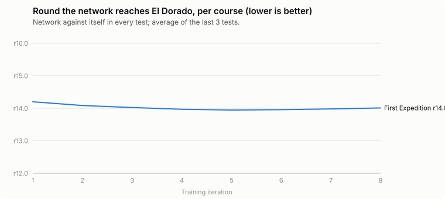
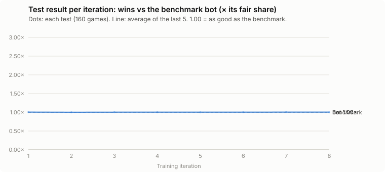
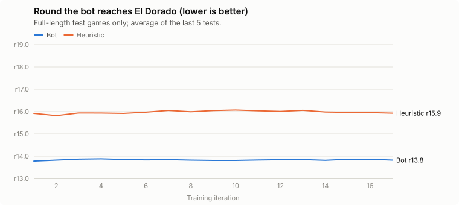
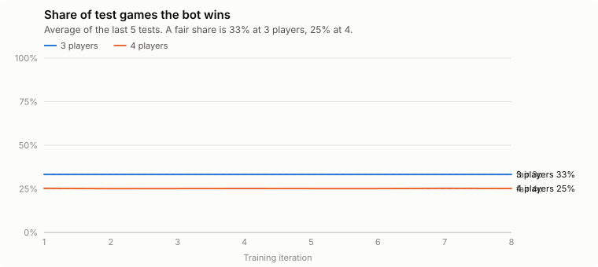

# Bot training: First Expedition

_Updated 04:50:18 UTC · started 01:34:28 · pushed within seconds of every change_

**Now:** iter 10 · horizon 30 rounds · exploration level 0.2 · 600 self-play games

**Games played so far:** 6,680

**How it trains:** the network starts untrained and learns only from its own games (self-play). Each game's result is what the finishing place is worth: 1st = 1, 2nd = ¼, 3rd = ⅛, last = 0 (3 players: 1 · ¼ · 0; 4 players: 1 · ¼ · ⅛ · 0); not arriving by round 25 = 0. Games are cut short at the current **horizon** (3 rounds, then 5, 8, 12, 16, then the full game capped at 25 rounds) and ranked by who got closest to El Dorado. The horizon grows once the bot beats the heuristic in two tests in a row (or stops improving while at least as good).

**Milestones:** 01:34:28 · START fine-tune on First Expedition only, from first-multi4-33 (the four-course network, level with the specialist on First: -10±11 +s / +8±11 plain) → 01:34:28 · FIX owner's plan: after all-maps training, per-map fine-tunes. MAPS=first, max backup + distillation, no heuristic seats, exploration 0.2, round cap 30; tests = network vs itself (arrival round); ladder vs first-distill-35

### Rounds to reach El Dorado (network against itself, all players who arrive) — lower is better

| Course | First test | Latest test | Winner's round (latest) |
|---|---|---|---|
| First Expedition | 14.2 | **13.99** | 12.82 |

### Test after each iteration: trained bot vs the benchmark bots, same horizon (half 3-player, half 4-player; no 2-player games anywhere)
**vs fair share: 1.00 = as good as the benchmark.** From 23:10 the benchmark is the stronger *planner* heuristic (it beats the old heuristic 1.54× its fair share), so the numbers drop at that point; (a fair share is 33% of 3-player games, 25% of 4-player games). "Route left" = cost of the remaining route when the game stops (lower = got further).

| Iter | Horizon (rounds) | Games so far | vs fair share | Wins 3p / 4p | Bot route left | Heuristic route left | Bot arrives in round | Heuristic arrives in round |
|---|---|---|---|---|---|---|---|---|
| 1 | 30 | 600 | **1.01** | 33% / 25% | 1.24 | – | 14.2 | – |
| 2 | 30 | 1,360 | **1.00** | 33% / 25% | 1.03 | – | 13.97 | – |
| 3 | 30 | 2,120 | **1.01** | 33% / 25% | 1.1 | – | 13.9 | – |
| 4 | 30 | 2,880 | **1.01** | 33% / 25% | 1.11 | – | 14.04 | – |
| 5 | 30 | 3,640 | **1.00** | 33% / 25% | 1.01 | – | 13.9 | – |
| 6 | 30 | 4,400 | **1.01** | 33% / 25% | 1.3 | – | 13.93 | – |
| 7 | 30 | 5,160 | **1.01** | 33% / 26% | 1.67 | – | 14.11 | – |
| 8 | 30 | 5,920 | **1.00** | 33% / 25% | 1.18 | – | 13.99 | – |

### What it buys (latest self-play batch, 600 games, horizon 30 rounds; exploration level 0.2: softmax choices, a few random moves, and in 10% of games every player starts with the same extra card (favouring cards the bot rarely buys))

| Card | Bought | Share |
|---|---|---|
| Photographer | 1800 | 10.3% |
| Giant Machete | 1797 | 10.2% |
| Compass | 1788 | 10.2% |
| Travel Log | 1777 | 10.1% |
| Prop Plane | 1775 | 10.1% |
| Scout | 1541 | 8.8% |
| Captain | 1371 | 7.8% |
| Cartographer | 1352 | 7.7% |
| Jack of All Trades | 1321 | 7.5% |
| Treasure Chest | 1117 | 6.4% |
| Trailblazer | 948 | 5.4% |
| Scientist | 364 | 2.1% |
| Journalist | 228 | 1.3% |
| Adventurer | 169 | 1.0% |
| Transmitter | 84 | 0.5% |
| Pioneer | 66 | 0.4% |
| Native | 34 | 0.2% |
| Millionaire | 19 | 0.1% |

### What it takes with the Transmitter (latest self-play batch; its own choices, no forced picks)

| Card | Taken | Share |
|---|---|---|
| Prop Plane | 15 | 20.5% |
| Transmitter | 10 | 13.7% |
| Cartographer | 8 | 11.0% |
| Adventurer | 7 | 9.6% |
| Journalist | 7 | 9.6% |
| Scientist | 7 | 9.6% |
| Trailblazer | 4 | 5.5% |
| Giant Machete | 3 | 4.1% |
| Native | 3 | 4.1% |
| Jack of All Trades | 3 | 4.1% |
| Pioneer | 3 | 4.1% |
| Scout | 1 | 1.4% |
| Millionaire | 1 | 1.4% |
| Travel Log | 1 | 1.4% |

### Every kind of decision the bot makes (latest self-play batch)
Each of these is also explored at random now and then, so the bot keeps testing alternatives.

| Decision | What it chose (count · share) |
|---|---|
| End of turn: cards kept | 0: 27273 (78%) · 1: 5617 (16%) · 2: 1544 (4%) · 3: 429 (1%) |
| Buying | bought a card: 17551 (50%) · could not afford anything: 11628 (33%) · could afford a card but bought nothing: 5684 (16%) |
| End of turn: which cards kept | Traveler: 2575 (26%) · Sailor: 1679 (17%) · Explorer: 1361 (14%) · Giant Machete: 918 (9%) · Captain: 841 (8%) · Photographer: 704 (7%) · Cartographer: 518 (5%) · Scout: 382 (4%) · Jack of All Trades: 258 (3%) · Trailblazer: 233 (2%) · Prop Plane: 162 (2%) · Scientist: 113 (1%) · Journalist: 59 (1%) · Treasure Chest: 56 (1%) · Native: 28 (0%) · Adventurer: 25 (0%) · Compass: 23 (0%) · Travel Log: 19 (0%) · Millionaire: 17 (0%) · Pioneer: 14 (0%) · Transmitter: 7 (0%) |
| Draw cards played | Cartographer: 4016 (48%) · Compass: 1778 (21%) · Travel Log: 1761 (21%) · Scientist: 822 (10%) |
| Base camp: cards removed from the game | Traveler: 2596 (43%) · Explorer: 2460 (41%) · Photographer: 280 (5%) · Sailor: 238 (4%) · Captain: 130 (2%) · Jack of All Trades: 84 (1%) · Scout: 54 (1%) · Treasure Chest: 28 (0%) · Trailblazer: 24 (0%) · Cartographer: 17 (0%) · Giant Machete: 15 (0%) · Journalist: 11 (0%) · Millionaire: 11 (0%) · Scientist: 10 (0%) · Prop Plane: 9 (0%) · Adventurer: 6 (0%) · Native: 5 (0%) · Transmitter: 3 (0%) · Travel Log: 1 (0%) · Compass: 1 (0%) |
| Blockades taken | #4: 411 (17%) · #3: 406 (17%) · #1: 402 (17%) · #5: 395 (16%) · #2: 395 (16%) · #6: 391 (16%) |
| Rubble: cards discarded | Traveler: 2226 (40%) · Explorer: 1565 (28%) · Sailor: 566 (10%) · Giant Machete: 410 (7%) · Photographer: 209 (4%) · Scout: 91 (2%) · Captain: 88 (2%) · Compass: 70 (1%) · Jack of All Trades: 66 (1%) · Prop Plane: 58 (1%) · Trailblazer: 55 (1%) · Cartographer: 55 (1%) · Treasure Chest: 21 (0%) · Travel Log: 15 (0%) · Native: 8 (0%) · Scientist: 7 (0%) · Adventurer: 5 (0%) · Millionaire: 3 (0%) · Pioneer: 3 (0%) · Journalist: 2 (0%) · Transmitter: 1 (0%) |
| Remove (Scientist / Travel Log): how many | 2: 1279 (50%) · 1: 697 (27%) · 0: 607 (23%) |
| Remove (Scientist / Travel Log): which card | Traveler: 1606 (49%) · Explorer: 1484 (46%) · Photographer: 41 (1%) · Sailor: 31 (1%) · Scout: 28 (1%) · Captain: 20 (1%) · Jack of All Trades: 13 (0%) · Giant Machete: 7 (0%) · Prop Plane: 6 (0%) · Trailblazer: 6 (0%) · Cartographer: 4 (0%) · Millionaire: 3 (0%) · Adventurer: 3 (0%) · Journalist: 2 (0%) · Scientist: 1 (0%) |
| Ended the turn without playing | Cartographer: 554 (53%) · Compass: 197 (19%) · Scientist: 161 (15%) · Travel Log: 107 (10%) · Native: 13 (1%) · Transmitter: 11 (1%) |
| Rubble blockade: cards given up | Traveler: 562 (48%) · Explorer: 254 (22%) · Sailor: 193 (16%) · Photographer: 57 (5%) · Captain: 29 (2%) · Giant Machete: 26 (2%) · Prop Plane: 17 (1%) · Jack of All Trades: 10 (1%) · Cartographer: 7 (1%) · Compass: 6 (1%) · Scout: 6 (1%) · Treasure Chest: 4 (0%) · Millionaire: 2 (0%) · Travel Log: 2 (0%) · Trailblazer: 2 (0%) · Scientist: 1 (0%) |
| Gift card given to every player (exploration) | Millionaire: 25 (38%) · Native: 13 (20%) · Scientist: 12 (18%) · Adventurer: 6 (9%) · Transmitter: 5 (8%) · Cartographer: 2 (3%) · Pioneer: 2 (3%) · Scout: 1 (2%) |
| Native | moved: 285 (100%) |

**Exploration in that batch:** picked a near-best option (softmax): 32541 · random kind of decision, random option: 1472 · turns with buying switched off: 701 · fully random action: 808 · games with a gift card for every player: 66

**Full-length games where someone hadn't arrived by round 25 (likely bugs, saved for inspection):** 28

### Reference
- Heuristic bot, 3 players, full game: first arrival ≈ round 15–16. Random play never finishes.
- Arrival columns stay empty until the horizon is long enough to reach El Dorado.
